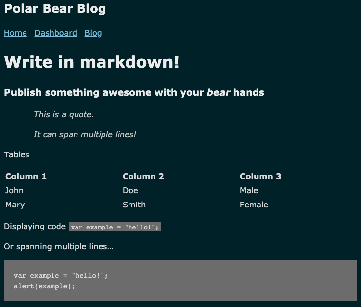
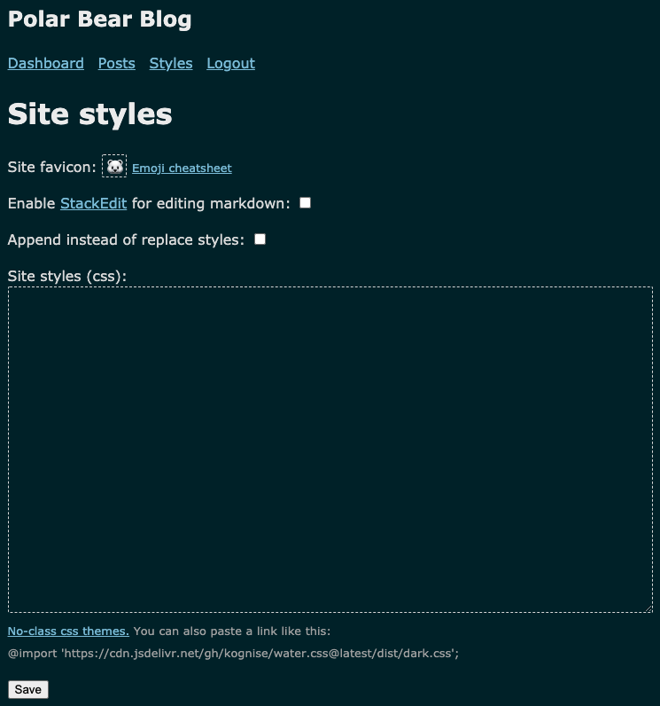
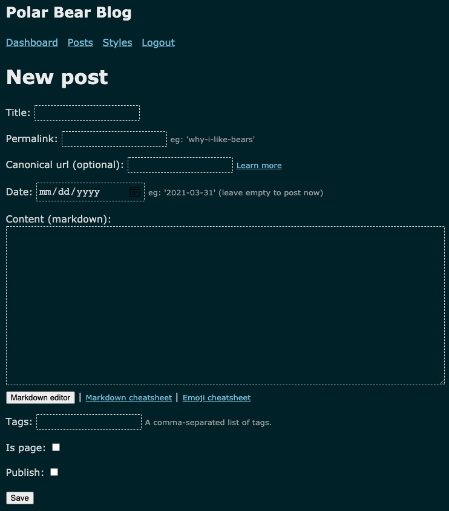
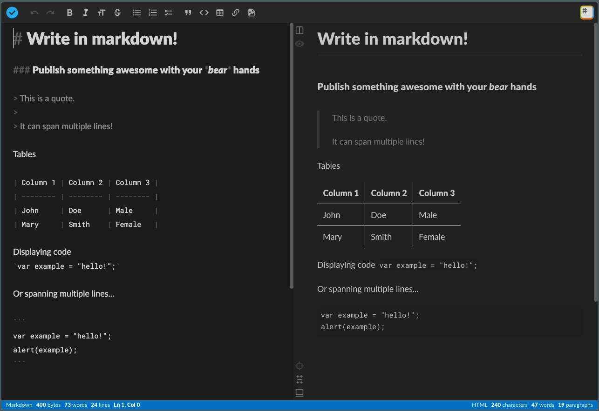

# Panda Blog 🐼

A modified and selfhostable version of [PandaBlog](https://github.com/fishy/pandablog), which is a fork of [PolarbearBlog](https://github.com/josephspurrier/polarbearblog).

## Quickstart on Local

- Clone the repository: `git clone https://github.com/chenghui-lee/pandablog-selfhost`
- Create a new file called `.env` in the root of the repository with this content:

```bash
# App Configuration
## Session key to encrypt the cookie store. Generate with: make privatekey
export PBB_SESSION_KEY=
## Password hash that is base64 encoded. Generate with: make passhash
export PBB_PASSWORD_HASH=
## Username to use to login to the platform at: https://example.run.app/login/admin
export PBB_USERNAME=admin
## Enable use of HTML in markdown editors.
export PBB_ALLOW_HTML=false
## Optional: enable MFA (TOTP) that works with apps like Google Authenticator. Generate with: make mfa
# export PBB_MFA_KEY=
## Optional: set the time zone from here:
## https://golang.org/src/time/zoneinfo_abbrs_windows.go
# export PBB_TIMEZONE=America/New_York

# MFA Configuration
## Friendly identifier when you generate the MFA string.
export PBB_ISSUER=www.example.com

# Cache TTL
## Cache TTL in case multiple instances are running and other instances made updates, default is 1m
## See https://pkg.go.dev/time#ParseDuration for format
export PBB_CACHE_TTL=1m

# Local Development
## Set this to any value to allow you to do testing locally without GCP access.
## See 'Local Development Flag' section below for more information.
export PBB_LOCAL=true
```

- To generate the `PBB_SESSION_KEY` variable for .env, run: `make privatekey`. Overwrite the line in the `.env` file.
- To generate the `PBB_PASSWORD_HASH` variable for .env, run: `make passhash passwordhere`. Replace with your password. Overwrite the line in the `.env` file.
- To create the session and site files in the storage folder, run: `make local-init`
- To start the webserver on port 8080, run: `make local-run`

The login page is located at: http://localhost:8080/login/admin.

To login, you'll need:

- the username from the .env file for variable `PBB_USERNAME` - the default is: `admin`
- the password from the .env file for which the `PBB_PASSWORD_HASH` was derived

Once you are logged in, you should see a new menu option call `Dashboard`. From this screen, you'll be able to make changes to the site as we as the home page. To add new posts, click on `Posts` and add the posts or pages from there.

### Local Development Flag

When `PBB_LOCAL` is set, the following things will happen:

- data storage will be the local filesystem instead of in Google Cloud Storage
- redirects will no be attempted so you can use localhost:8080
- MFA, if enable will accept any number and will always pass validation
- Google Analytics will be disabled if set
- Disqus and Cactus will be disabled if set

## Quickstart Using Docker
To run the application using docker, clone the repository and perform the following copy operations:
```
cp storage/initial/session.bin storage/session.bin
cp storage/initial/site.json storage/site.json
```
Then modify the `docker-compose.yml` according to your preferences.
At last, run `docker-compose up -d` and the application is accessible at `localhost:8080`.

## Screenshots

### Home Page



### Dashboard


### Custom Styles



### Create a Post



### View a Post


### StackEdit


